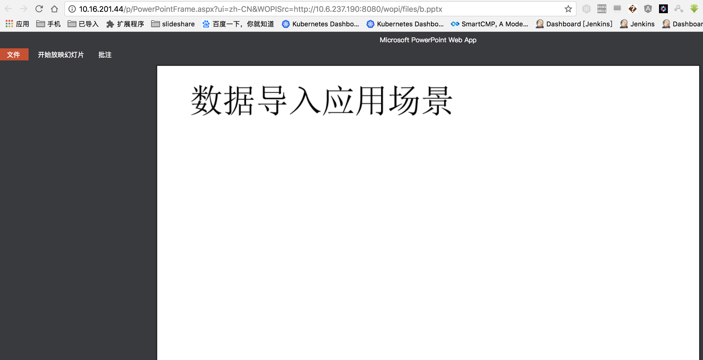

# office web app server 文档预览服务安装

* docs

> msdn 安装以及部署说明文档，注意需要域环境

* wopi 接口demo

> 项目使用spring boot  jdk 1.8

## 安装部署

> 需要的软件包 链接: https://pan.baidu.com/s/1kYCM6BPQ2VPFOkVoEbwXvg 提取码: 4ynp

> 我安装使用的是windows server  2012 r2 datacenter 版

> .net framework 选择 4.5 

### 安装顺序

> 参考docs/部署 Office Web Apps Server.pdf 即可，主要是加入域以及使用域账户登陆操作

## wopi 集成

> 参考wopihost

* 构建&&运行(我使用了我本地的路径读取文件，实际场景进行修改即可)

```code
mvn  clean package
java -jar target/wopihost-0.0.1-SNAPSHOT.jar
```

* 文件预览参考格式

> 注意10.6.237.190 是我本机ip 实际进行修改即可

> 同时最好对于文件进行安全访问控制，使用access_token

> 参考 docs/[MS-WOPI].pdf

```code

格式：

word 

http://[owas.domain]/wv/wordviewerframe.aspx?WOPISrc=http://[WopiHost.domain]:8080/wopi/files/test.docx&access_token=123 

http://10.16.201.44/wv/wordviewerframe.aspx?WOPISrc=http://10.6.237.190:8080/wopi/files/b.doc

ppt

http://[owas.domain]/p/PowerPointFrame.aspx?ui=zh-CN&WOPISrc=http://[WopiHost.domain]:8080/wopi/files/test.pptx&access_token=123

http://10.16.201.44/p/PowerPointFrame.aspx?ui=zh-CN&WOPISrc=http://10.6.237.190:8080/wopi/files/b.pptx

excel 

http://[owas.domain]/x/_layouts/xlviewerinternal.aspx?ui=zh-CN&rs=zh-CN&WOPISrc=http://[WopiHost.domain]:8080/wopi/files/test.xlsx

http://10.16.201.44/x/_layouts/xlviewerinternal.aspx?ui=zh-CN&rs=zh-CN&WOPISrc=http://10.6.237.190:8080/wopi/files/a.xlsx


http://10.16.201.44/x/_layouts/xlviewerinternal.aspx?ui=zh-CN&WOPISrc=http://10.6.237.190:8080/wopi/files/a.xlsx

pdf

http://[owas.domain]/wv/wordviewerframe.aspx?PdfMode=1&ui=zh-CN&WOPISrc=http://[WopiHost.domain]:8080/wopi/files/test.xlsx

http://10.16.201.44/wv/wordviewerframe.aspx?PdfMode=1&ui=zh-CN&WOPISrc=http://10.6.237.190:8080/wopi/files/a.pdf
```

## 一些截图




